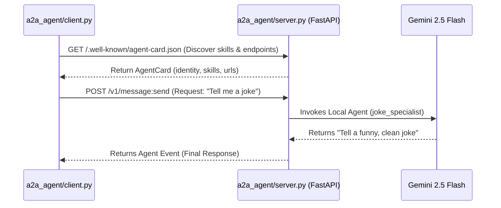

# ADK 2.0 Agent-to-Agent (A2A) Example

This directory contains a complete, working example of the distributed **Agent-to-Agent (A2A)** protocol using Google's Agent Development Kit (ADK) 2.0. 

A2A allows independent, self-contained agents to interact with one another over standard network protocols (like HTTP+JSON), making it easy to create supervisor-specialist architectures where specialized agents can run on separate microservices.

---

## Architecture Overview



1. **The Server (`server.py`)**:
   - Exposes a local LLM agent (`joke_specialist`) powered by `gemini-2.5-flash`.
   - Mounts standard A2A protocol routes using FastAPI.
   - Serves an `AgentCard` describing its capabilities and skills (such as telling jokes) at `http://localhost:8005/.well-known/agent-card.json`.

2. **The Client (`client.py`)**:
   - Uses `RemoteA2aAgent` to connect to the server's endpoint.
   - Reads the remote agent's `AgentCard` dynamically to determine how to communicate with it.
   - Sends a joke request, receives real-time agent execution events, and displays the response.

---

## How to Run the Example

All dependencies are defined in the project's root `pyproject.toml` and are managed using `uv`. Make sure you have your `.env` configured with your Gemini API credentials (e.g., `GEMINI_API_KEY`) before running.

### Step 1: Start the A2A Server
Run the A2A server. It will launch on `http://localhost:8005/`.

```bash
# In your terminal (from the project root directory)
source .env
uv run python a2a_agent/server.py
```

### Step 2: Run the A2A Client
Open a second terminal window and run the client script. The client will query the server on port 8005 and print the remote agent's response.

```bash
# In another terminal window (from the project root directory)
source .env
uv run python a2a_agent/client.py
```

---

## File Structure

- [server.py](file:///home/mrocc/adk2_workshop/a2a_agent/server.py): Defines the FastAPI web application, configures the `AgentCard` and mounts the `A2aAgentExecutor` to handle messages.
- [client.py](file:///home/mrocc/adk2_workshop/a2a_agent/client.py): Initializes the `RemoteA2aAgent` target using the server's HTTP metadata and routes queries to it.
